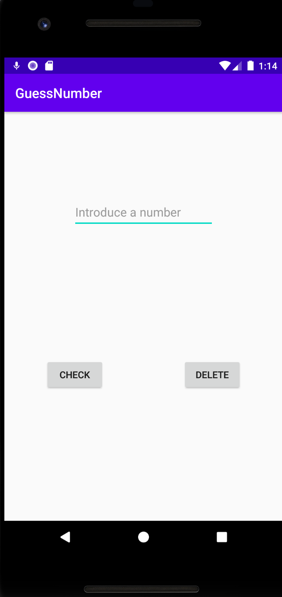

<h1>Proyecto GuessNumber</h1>

<h3>IDIOMAS DISPONIBLES = ESPAÑOL y ENGLISH</h3>

Con este proyecto lo que quiero conseguir es crear un juego donde el usuario tenga que averiguar un número entre 0 y 100

Para esto he usado una clase POJO, llamada [Number](app/src/main/java/com/jesusc24/guessnumber/data/model/Number.java) para poder crear el número aleatorio y 
poder guardar la información de los intentos y el nombre del jugador.

La activity [ConfigActivity](app/src/main/java/com/jesusc24/guessnumber/ui/ConfigActivity.java) muestra un EditText para poder poner el nombre del jugador, 
y el número de intentos que quiere ponese para acertar el número. Esta información se le mando a la activity [PlayActivity](app/src/main/java/com/jesusc24/guessnumber/ui/PlayActivity.java) para que el jugador 
ponga diferentes números. Se le va diciendo si está por encima o por debajo del número. Si acierta, se abre la activity [EndPlayActivity](app/src/main/java/com/jesusc24/guessnumber/ui/EndPlayActivity.java)
que le dará la enhorabuena por haber acertado y los intentos ha usado. Si se acaban los intentos y no ha acertado el número le dirá el número correcto.

Imagen de la primera <code>Activity</code> de mi aplicación, que es donde se introduce el nombre y el número de intentos

Imagen de la segunda <code>Activity</code> de mi aplicación, donde se tiene que introducir el número a probar

Imagen de la tercera <code>Activity</code> de mi aplicación, en el caso de acertar

